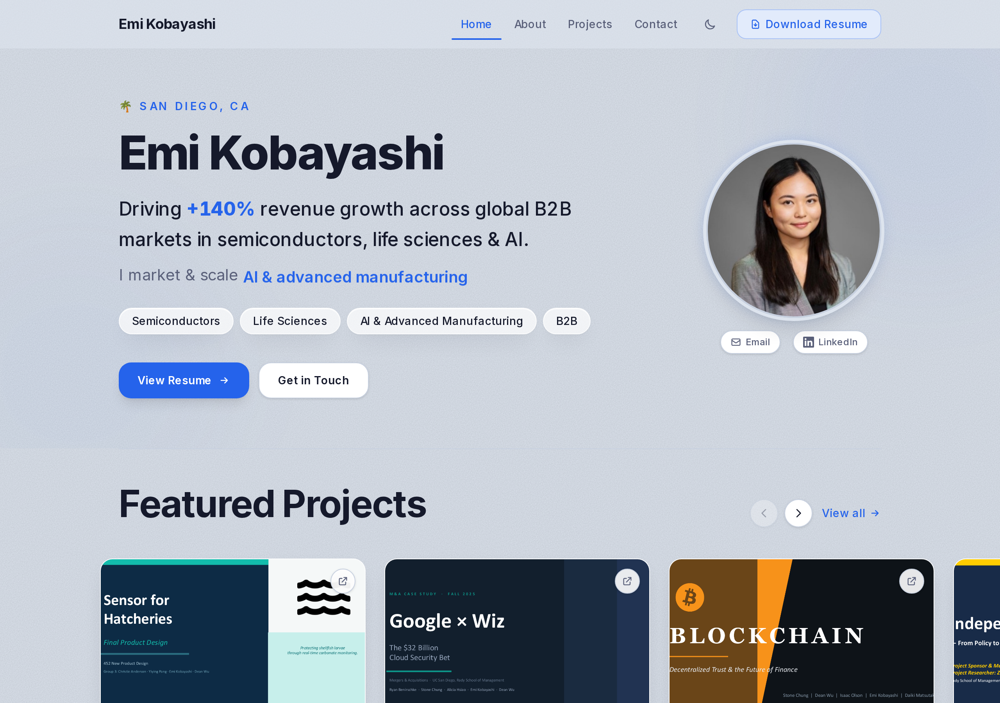

# Emi Kobayashi — Personal Website

A fast, multilingual personal site and portfolio, live at **[emikoba.com](https://emikoba.com)**.



> I'm a marketer, not an engineer. I built and shipped this entire website by "vibe coding" — describing what I wanted in plain English to an AI assistant and refining it together, one conversation at a time. This repo is the result.

## The story behind it

Like a lot of non-technical people, I'd always assumed building a real website meant either learning to code for months or paying someone else to do it. Then I tried **vibe coding**: instead of memorizing syntax, you describe the outcome you want ("make the headline count up to 140%", "add a dark mode toggle", "translate the whole site into Japanese and Chinese") and an AI writes and edits the code with you. You stay in the driver's seat — reviewing, testing in the browser, and asking for changes — without needing to know every technical detail up front.

A few weeks of evenings later, this is a polished, production site I'm proud to put on my résumé. The point isn't that the code is perfect — it's that a motivated non-technical person can now go from idea to a live, professional website. If you're curious whether you could do the same: you can.

## Why this is worth a recruiter's two minutes

- **$0 to host and maintain.** The site is served free on **GitHub Pages**. There's no monthly bill, no server to babysit — every push to the repo automatically rebuilds and redeploys it.
- **0 known security vulnerabilities.** Dependencies are kept patched; `npm audit` currently reports zero issues.
- **Trilingual out of the box.** The whole experience is available in **English, Japanese, and Chinese**, including a downloadable résumé in each language.
- **Built to feel premium.** Responsive on phone and desktop, light/dark mode, smooth animations, and a real custom domain.
- **Shows initiative and AI fluency.** I taught myself to build and ship this with modern AI tools — the same kind of self-directed, tech-curious mindset I bring to marketing work.

## What I learned along the way

- How to break a big idea ("build me a portfolio site") into small, testable requests.
- How to read what the code does well enough to know whether it's doing the right thing.
- How websites actually get online — domains, automatic deploys, and keeping dependencies safe.
- That "I'm not technical" is a starting point, not a ceiling.

## Want to poke around the code?

You don't need to, but if you'd like to run it on your own machine:

```bash
npm install   # one-time setup
npm run dev    # then open http://localhost:3000
```

All of the site's content (bio, projects, experience, skills) lives in one plain file, `src/data/profile.ts`, so updating it doesn't require touching the design.

## Built with

Next.js, TypeScript, and Tailwind CSS — assembled conversationally with AI assistance, hosted free on GitHub Pages.
